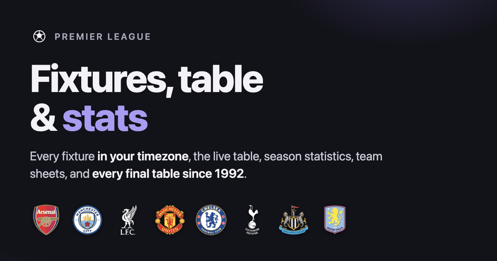

# Premier League fixture viewer

[](https://github.com/ismayc/premier-league/actions/workflows/ci.yml)
[](https://github.com/ismayc/premier-league/actions/workflows/ci.yml)
[](./LICENSE)

A React + Vite web app showing all 380 matches of the Premier League season in
**your** timezone, with where to watch, the live table, season statistics,
team sheets, and **every final table since the competition began in 1992-93**.

🔗 **Live:** https://premier-league-viewer.netlify.app · https://ismayc.github.io/premier-league/



## Features

- **Your timezone** — kickoff times auto-convert to your detected timezone
  (switchable to 15+), with the zone shown on each card and UK time alongside
  in the match detail, so the app can be checked against any published fixture
  list.
- **Five views** — a chronological **Fixtures** list grouped by day, a
  Monday–Sunday **Week** calendar, the live **Table**, season **Stats**, and
  **History** back to 1992-93.
- **Fixture cards** — each match shows kickoff time and zone (or a Final / Live
  badge), both clubs, the score, the **venue**, and **where to watch** once
  broadcasters are assigned. Styled after a clean schedule card and stacked so
  club names stay legible on a phone.
- **Follow clubs** — star any club to highlight it everywhere and filter the
  fixtures to just the clubs you follow (saved in your browser).
- **Live alerts** — switch on the bell and the app toasts goals, red cards,
  kick-off and full time as they happen, narrowed to the clubs you follow.
  Detected by diffing successive polls, so it needs no play-by-play feed.
- **My services** — tell the app which streaming services and TV packages you
  have and the fixtures list can be narrowed to matches you can actually watch.
  Kept in your browser rather than the URL, since a shared link should not
  filter someone else's list by your subscriptions.
- **Next-kickoff bar** — a live countdown to the next match still to come.
- **Live table** — the standings computed from results as they land, with
  **home/away splits**, recent **form**, and the Champions League / Europa /
  Conference / relegation bands (named in a legend, never colour alone).
- **Stats** — player leaderboards across ten categories (goals, assists, shots,
  saves, cards…) with a season switcher back to 2017-18; click a player for
  their season tally plus position, nationality and height. Plus season totals
  and an **attack-and-defence** chart for the current season *or any past one*.
- **History** — every **final table since 1992-93**, computed from match
  results (not copied) and verified; an **all-time** table ranked by points and
  points-per-match; and any club's **finishing position season by season** as a
  chart.
- **Team drawer** — click a club anywhere for its form, home and away records,
  upcoming fixtures, leading scorers, and full season-by-season history.
- **Team sheets** — opening a match shows both formations, the starting XI by
  line, the bench, and the substitutions with the minute each was made. Click a
  player to expand their match — goals, assists, shots, fouls, cards — with
  their position, nationality and height. (Lineups appear about an hour before
  kickoff.)
- **Add to calendar** — per-match and whole-season `.ics` export, optionally
  filtered to the clubs you follow.
- **Spoiler-free mode** — hide scores globally; a finished match reads as an
  ordinary upcoming card until you open it.
- **Light/dark theme** — follows your system preference, with no flash on load.
- **Shareable URLs** — view, timezone, spoiler mode, club and season persist to
  the query string; links unfurl with a title/description/image preview in chat
  apps.
- **Accessible** — keyboard-navigable, focus-trapped modals that restore focus
  on close, screen-reader labels on live/score badges, and data never carried
  by colour alone.
- **Live results** — final scores and in-match score + clock overlaid from
  [ESPN](https://www.espn.com/soccer/)'s public scoreboard (no API key) while
  games are underway, auto-refreshed; if the fetch fails the committed data
  still renders.

## Views

| View | What it shows |
|---|---|
| **Fixtures** | The season as a chronological list, grouped by day, with a next-kickoff countdown. Filter to followed clubs, show or hide played matches, export to calendar. |
| **Week** | A Monday-to-Sunday grid. Makes an empty midweek and a congested festive period legible at a glance. |
| **Table** | The live league table, with home/away splits, recent form, and European / relegation bands. |
| **Stats** | League totals, player leaderboards across ten categories with a season switcher, per-player biographies, and a per-club goal-difference chart for any season. |
| **History** | Every final table since 1992-93, an all-time table, and any club's finishing position season by season. |

## Running it

```sh
npm install
npm run dev
```

`npm test` runs the suite; `npm run test:coverage` adds the coverage report;
`npm run build` produces a static `dist/`.

The suite is held at **100% coverage** — statements, branches, functions and
lines — and `vite.config.js` sets thresholds so CI fails if anything ships
untested. Test files run serially (`fileParallelism: false`) because Vitest's
v8 coverage provider races when several workers finish at once and dies trying
to read a temp file that has already been cleaned up.

## How the data works

The entire season, every historical table, and the player leaderboards are
**committed to the repository as generated JavaScript modules**. The app
therefore renders completely with no network request at all. A small live
overlay polls ESPN's scoreboard for matches in progress and patches scores in
on top; if that fetch fails, the app is stale rather than broken.

```
scripts/fetch-fixtures.mjs   → src/data/teams.js, src/data/fixtures.js, public/logos/
scripts/fetch-stats.mjs      → src/data/players.js
scripts/fetch-history.mjs    → src/data/history.js
```

Refresh everything with `npm run fetch:all`. The scripts use **Node built-ins
only** — no imports from `node_modules` — so a scheduled refresh can run
without an `npm ci` first.

### Why historical tables are computed, not fetched

ESPN's standings archive only reaches 2002-03. openfootball publishes match
results back to 1992-93, so `fetch-history.mjs` parses those results and
computes each table itself, applying the same ordering rules the live table
uses — points, then goal difference, then goals scored. The Premier League has
never used head-to-head to separate clubs for a placing.

That makes the tables verifiable rather than merely copied. Before writing,
every season is checked against invariants that must hold for any correct
parse: total appearances equal twice the match count, goal difference across
the league sums to zero, and points equal three per decisive match plus two
per draw. A season that fails is reported rather than silently written. Those
same invariants run again in `test/history-data.test.js` over the committed
data, so a bad refresh fails the build instead of shipping a wrong table.

### Known data caveats

- **The 2026-27 season has not kicked off**, so the table is empty and the
  Stats view's player leaderboards default to the most recent season that has
  data. They switch over automatically once matches are played.
- **ESPN publishes no player leaders for 2020-21.** That season is absent from
  the Stats switcher rather than shown as zeroes.
- **Broadcasters are assigned only weeks ahead**, so most of a freshly-fetched
  season carries no listing at all. The scheduled data refresh fills them in as
  they are published, and the "on my services" filter deliberately keeps a
  match whose broadcaster is still unannounced — not yet listed is not the same
  as not available.
- **The first three seasons had 22 clubs and 42 matches.** Point totals from
  1992-93 to 1994-95 are not comparable with later seasons, and the History
  view says so. Four clubs were relegated in 1994-95 to cut the League to 20.
- **Conference League qualification** is usually decided by domestic cup
  results, which this app does not track, so the sixth-place band is
  indicative only.

## Design notes

**No router, no state library.** The set of things a viewer can choose — view,
timezone, club, whether scores are hidden — is small enough to live in
`useState` and serialise into the query string, which has the useful property
that any state worth reaching is shareable. Only non-default values are
written, so a first-time URL stays clean.

**One impure boundary.** `App.jsx` fetches and merges; everything downstream is
a pure function of the merged fixture list. That is why nearly all the logic is
testable without a DOM.

**Data-mark colours are separate from UI colours.** The accent never encodes
data, so a coloured mark is never mistaken for a control. The chart and
league-zone palettes were checked for colour-vision separation and contrast
against both the light and dark surfaces, and colour never carries meaning
alone — positions are always printed, zones are named in a legend, and every
bar is labelled with its value.

**Kickoffs are stored as UTC instants**, never as wall-clock strings. Premier
League times are published in UK time, which is exactly what a naive "3pm
Saturday" gets wrong for anyone outside Britain twice a year when the clocks
shift. The detail view shows both your local time and UK time so the app can be
checked against any published fixture list.

## Data sources

- **Fixtures, clubs, crests, live scores, broadcasters** —
  [ESPN](https://www.espn.com/soccer/)'s public, keyless, CORS-open feeds. The
  fetch scripts snapshot the season into the repo; the app overlays live scores
  at runtime.
- **Player statistics** — ESPN's core-API leaders endpoint, per season back to
  2017-18 (2020-21 is absent upstream and omitted rather than shown as zeroes).
- **Historical tables** — computed from
  [openfootball/england](https://github.com/openfootball/england) match results
  (public domain), which reach back to 1992-93 where ESPN's standings archive
  stops at 2002-03. Each season is verified against structural invariants before
  it is written (see *Why historical tables are computed, not fetched* above).

Broadcast listings come from ESPN's US-region feed, so they name US
broadcasters (NBC, Peacock, USA Network) rather than UK ones.

## Credits

Created by [Chester Ismay](https://chester.rbind.io). Source on
[GitHub](https://github.com/ismayc/premier-league). Companion to the
[World Cup 2026 schedule viewer](https://github.com/ismayc/world-cup-viewer).

The favicon lion is [Lion by Lorc](https://game-icons.net/1x1/lorc/lion.html)
from [game-icons.net](https://game-icons.net), used under
[CC BY 3.0](https://creativecommons.org/licenses/by/3.0/) and recoloured to the
app's accent. It is not the Premier League's crowned-lion mark.

## Disclaimer

An unofficial, non-commercial fan project. **Not affiliated with, endorsed by,
or sponsored by the Premier League.** "Premier League", and club, broadcaster,
and competition names and crests are trademarks of their respective owners.
Fixtures, statistics and live scores come from
[ESPN](https://www.espn.com/soccer/); historical results come from the
public-domain [OpenFootball](https://github.com/openfootball/england) project.

Licensed under the [MIT License](./LICENSE).
